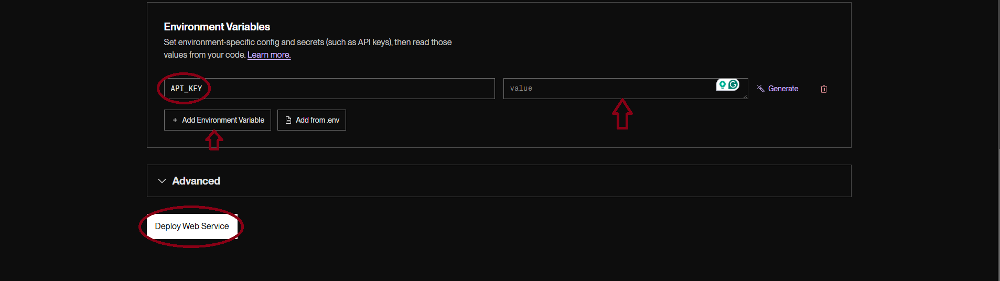

1-Stop Car Shop

Created by: John Camargo, Kylie Sanchez, Jackson Seales, Lucas Estevez

# What is 1-Stop Car Shop?

Welcome to 1-Stop Car Shop! This free software combines “all present market listings” (simulated data) for new and used cars onto one website (by means of a large, constantly updating database of cars) with recently sold car prices included (if applicable) and provides a way to have your car’s price estimated instantly (with the help of MarketCheck’s Price Predictor API). Save time by using the functionalities of our web service, rather than finding each function of the service on a different site!

This web service was created mainly as a team-based class project for CS3300 at the University of Colorado Colorado Springs by Computer Science students John Camargo, Jackson Seales, Kylie Sanchez, and Lucas Estevez

# Built With

- Python (data creation, Flask for backend)
- HTML and CSS with JS
- SQLite 3
- MarketCheck’s Price Predictor API

# Developer Set-up and Execution

### Prerequisites

- GitHub account
- Flask version 3.0.3
- requests version 2.25.1
- bcrypt version 4.2.1
- flask_cors version 5.0.0
- flask-jwt-extended version 4.7.0
- email-validator version 2.2.0

### Installation and Hosting/Execution

1. Create an account and get a free Car Price Predictor API key at [https://www.marketcheck.com/apis/](https://www.marketcheck.com/apis/%20)

2. Clone the repo:
git clone <https://github.com/LucasJEstevez/CS3300-Semester-Project>

3. Create a Render account (Get Started for Free) and link to your Github account at <https://render.com/>

4. Once you have an account with Render which is attached to your GitHub account, in the Dashboard, click the “+ New” tab next to your current workspace in the top-left of the page. Select Web Service. You should see the GitHub repository you just cloned as one of the first options under ”Git Provider”. Alternatively, you can paste the link to the GitHub repository directly into the “Public Git Repository” section.

5. Next, after naming the project, you can leave most sections blank/with their default values, but scroll to Build Command and Start Command, and input: pip install -r requirements.txt and ./start_app.sh respectively. Also ensure you are using the “Free” Instance Type (can use others if you’d like, unnecessary).

6. Finally, before deploying the web service, scroll to Environment Variables and enter API_KEY as an environment variable (inputting the key string given to you by MarketCheck to the “value” space); hit “+ Add Environment Variable”. Set up complete! Hit “Deploy Web Service” and wait a few minutes for the web service to spin up.

7. To go to the web site for the service, follow the link provided by Render towards the top of the page. As long as the service is not suspended, this link is sharable and can be used by others.

8. To suspend the service, navigate to the Settings section on the left-hand side of the Render menu, and scroll until you see “Suspend Web Service” in red text (which you simply click once).

# User Usage

1. Once the web service is deployed, all the user needs to access the service is a link to the website (which if you are a developer, you can find on your Render Dashboard)
2. Visit <https://cs3300-semester-project-ekbv.onrender.com>
3. Unregistered users can browse available cars and navigate to all pages except for the sell page and saved cars page.
    - If a user is trying to access the sell page without being logged in, it will re-direct to the login/register pages.
    - Users can login/register using a username and/or valid email and password (which is hashed with BCrypt)

The user logo in the top right corner of each page will link to the necessary pages.

1. Any user may navigate to the Buy page, where they can filter through a large list of cars using intuitive buttons which are reactive and filter as you press
2. Any user may navigate to the About page, which explains what the service is and why it exists
3. Any user may navigate to the Contact Us page, which has a link to our GitHub along with an email users may reach out to with questions
4. Any user may navigate to the Terms page, which details the licenses used by the service and by MarketCheck (to use their API)

# Features

### Functional

Functional reqs

### Non-Functional

Non-functional reqs

# Papa Parse

Our software uses an external resource called Papa Parse. This is a CSV parser using JavaScript that we implemented to parse through our car data and display it to our various webpages. As we parse through the CSV, each row is appended to an HTML class. Due to the large size of our data, we used the step option provided by Papa Parse which streams the input. This can result in slower load times depending on the file’s relative location but felt necessary for the size of our files due to limited browser memory.

Papa Parse GitHub: <https://github.com/mholt/PapaParse>

# SQLite3

Our software uses an external database tool called SQLite3, a software library that provides a lightweight database engine which allows us to store our user-login information.

# BCrypt

In order to store our user data securely, we use BCrypt to hash our users’ passwords before storing them in our database so we do not keep plaintext passwords stored.
