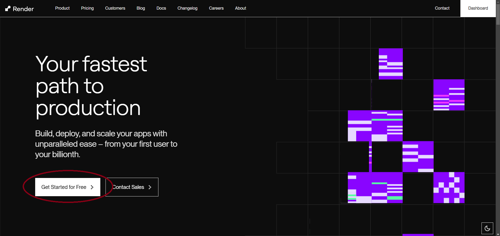
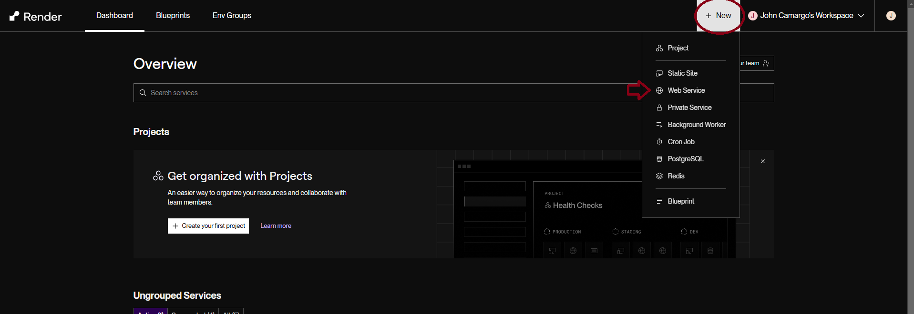
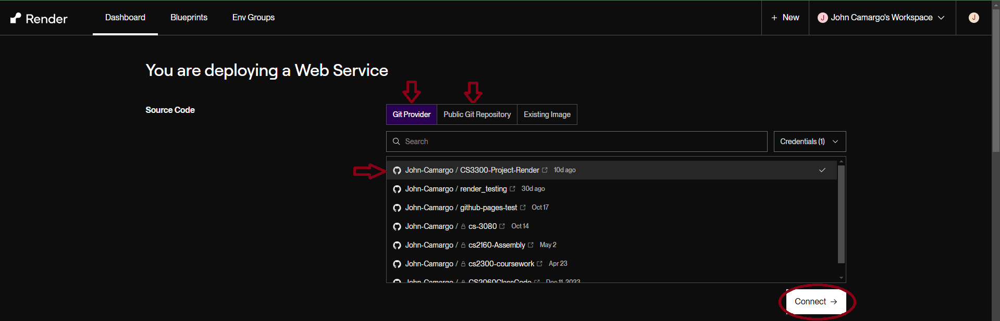
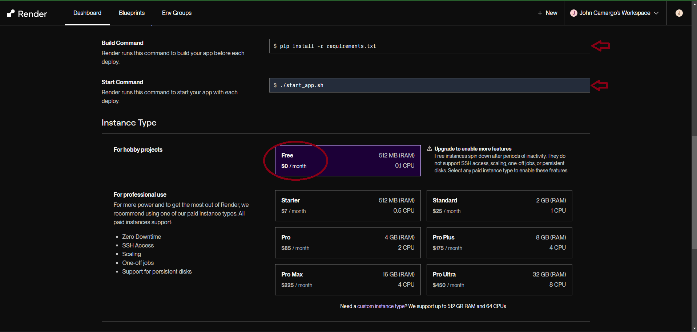
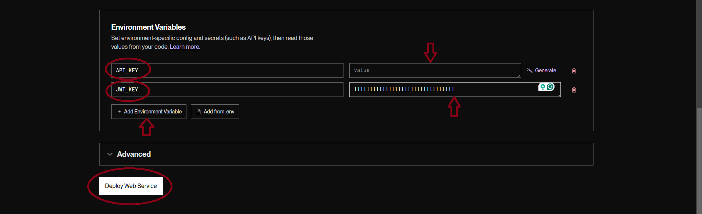
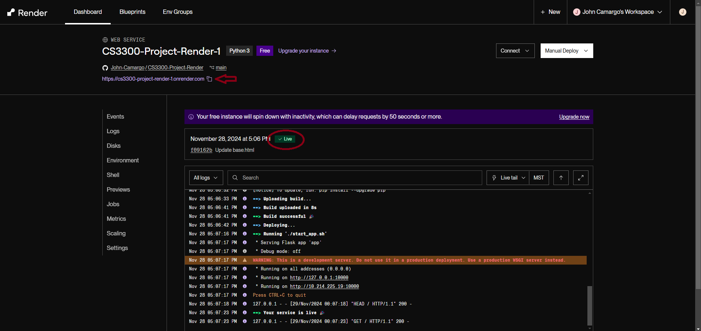
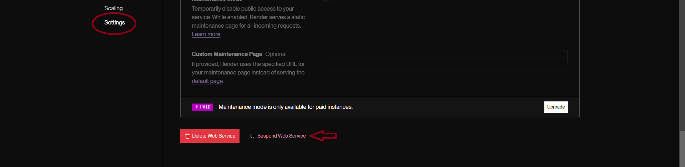

<!-- Commented sections were guided by the Best-README-Template GitHub Repository (which we did not use any "templates" from, just looked at for ideas/banners (https://github.com/othneildrew/Best-README-Template) -->
<!-- Converted README originally from .docx to .md using https://word2md.com/ -->

<!-- Contributors and License banners -->
[![Contributors][contributors-shield]][contributors-url]
[![AFL License][license-shield]][license-url]

<!-- PROJECT LOGO -->
 

  

    Created by: John Camargo, Kylie Sanchez, Jackson Seales, Lucas Estevez

# What is 1-Stop Car Shop?

Welcome to 1-Stop Car Shop! This free software combines “all present market listings” (simulated data) for new and used cars onto one website (by means of a large, constantly updating database of cars) with recently sold car prices included (if applicable) and provides a way to have your car’s price estimated instantly (with the help of MarketCheck’s Price Predictor API). Save time by using the functionalities of our web service, rather than finding each function of the service on a different site!

This web service was created from scratch mainly as a team-based class project for CS3300 at the University of Colorado Colorado Springs by Computer Science students John Camargo, Jackson Seales, Kylie Sanchez, and Lucas Estevez

  
# Built With

- Python (data creation, Flask for backend)
- HTML and CSS with JS
- SQLite 3
- MarketCheck’s Price Predictor API
- Render (Web Hosting)

  
# Developer Set-up and Execution

### Prerequisites

- GitHub account
- Flask version 3.0.3
- requests version 2.25.1
- bcrypt version 4.2.1
- flask_cors version 5.0.0
- flask-jwt-extended version 4.7.0
- email-validator version 2.2.0

### Architecture

/root 
&emsp;| -- /Code 
      &emsp;&emsp;&emsp;| -- Python/.py files (not including app.py) 
&emsp;| -- /User Data 
      &emsp;&emsp;&emsp;| -- Files such as saved_cars.csv, and user database 
&emsp;| -- /Documentation 
      &emsp;&emsp;&emsp;| -- Data 
      &emsp;&emsp;&emsp;| -- Devs and Users 
      &emsp;&emsp;&emsp;| -- Images 
      &emsp;&emsp;&emsp;| -- Legal 
&emsp;| -- /static&emsp;<-- Flask is designed to serve static files only from the static directory by default 
      &emsp;&emsp;&emsp;| -- Car Data 
      &emsp;&emsp;&emsp;| -- CSS_Files 
      &emsp;&emsp;&emsp;| -- Images 
      &emsp;&emsp;&emsp;| -- PapaParse (in this case used for .csv parsing) 
&emsp;| -- /templates&emsp;<-- will keep all the web pages/html files 
      &emsp;&emsp;&emsp;| -- base.html (optional if using Jinja) 
      &emsp;&emsp;&emsp;| -- index.html 
      &emsp;&emsp;&emsp;| -- Directories for different landing pages 
&emsp;| -- /Testing&emsp;<-- includes test case files and other files for testing deployments 
&emsp;| -- .gitattributes 
&emsp;| -- render.yaml&emsp;<-- render template file; go to Tools -> Render for more information 
&emsp;| -- requirements.txt&emsp;<-- system dependencies to be installed on deployment (Prerequisites) 
&emsp;| -- app.py&emsp;<-- creates backend (server) for service; includes routes and price predictor/user logic 
&emsp;| -- start_app.sh&emsp;<-- runs app.py (which builds the backend) 
&emsp;| -- LICENSE/README 

### Installation and Hosting/Execution

1. Create an account with MarketCheck and get a free Car Price Predictor API key at [https://www.marketcheck.com/apis/](https://www.marketcheck.com/apis/%20)

2. Clone the repo (this step is optional as you may also just provide a URL to this repo instead); more info can be found at <https://docs.github.com/en/repositories/creating-and-managing-repositories/cloning-a-repository>:
 git clone <https://github.com/LucasJEstevez/CS3300-Semester-Project>

3. Create a Render account (Get Started for Free) and link to your Github account at <https://render.com/>. You can also find more information on Render Hosting here!

4. Once you have an account with Render which is attached to your GitHub account, in the Dashboard, click the “+ New” tab next to your current workspace in the top-left of the page. Select Web Service. You should see the GitHub repository you just cloned as one of the first options under ”Git Provider”. Alternatively, if you choose not to clone the repo, you can paste the link to this GitHub repository directly into the “Public Git Repository” section.

5. Next, after naming the project, you can leave most sections blank/with their default values, but scroll to Build Command and Start Command, and input: pip install -r requirements.txt and ./start_app.sh respectively. Also ensure you are using the “Free” Instance Type (can use others if you’d like, unnecessary).

6. Finally, before deploying the web service, scroll to Environment Variables and enter API_KEY as an environment variable (inputting the key string given to you by MarketCheck to the “value” space) and JWT_KEY as an environment variable (can be a randomly generated string of numbers and letters; input the key string to the “value” space); hit “+ Add Environment Variable”. Set up complete! Hit “Deploy Web Service” and wait a few minutes for the web service to spin up.

7. To go to the website for the service, follow the link provided by Render towards the top of the page. As long as the service is not suspended, this link is sharable and can be used by others.

8. To suspend the service, navigate to the Settings section on the left-hand side of the Render menu, and scroll until you see “Suspend Web Service” in red text (which you simply click once).

From there, feel free to add to, delete, and create any files in the repository (though some files like render.yaml and index.html are necessary for Render hosting)!

  
# User Usage

1. Once the web service is deployed, all the user needs to access the service is a link to the website (which if you are a developer, you can find on your Render Dashboard).
2. Users visit <https://cs3300-semester-project-ekbv.onrender.com>.
3. Unregistered users can browse available cars and navigate to all pages except for the sell page and saved cars page.
    - If a user is trying to access the sell page without being logged in, it will re-direct to the login/register pages.
    - Users can login/register using a username and/or valid email and password (which is hashed with BCrypt).

4. The user logo in the top right corner of each page will link to the Sign In and Register pages when not signed in; if logged-in, it will link to the user's Saved Cars and a Sign Out button. 
5. Any user may navigate to the Buy page, where they can filter through a large list of cars using intuitive buttons that are reactive and filter as you press. They may save cars they are interested in if they log in or create an account. 
6. Any user may navigate to the About page, which explains what the service is and why it exists; also includes links to more information on the service. 
7. Any user may navigate to the Contact Us page, which has a link to our GitHub along with an email users may reach out to with questions 
8. Any user may navigate to the Terms page, which details/links the licenses used by the service and by MarketCheck (to use their API) 
9. Any user may navigate to the Register page, which allows users to create a 1-Stop Car Shop account as long as they provide a username, password, and valid email address. 
10. Any user may navigate to the Sign In page, which allows users with existing 1-Stop Car Shop accounts to sign/log in and gain access to their saved cars and the ability to save cars in the first place. Also links to Register page in case the user does not have an account.  
11. Logged-in users may navigate to the Sell page, which allows users with accounts to input a car's information for it to become an available car on the Buy page of the site. 
12. Logged-in users may navigate to the Saved Cars page (from the user drop-down button), which displays a list of cars the logged user's saved cars (which they saved from the Buy page) 

  
# Features

### Functional Requirements

- Ability to estimate a car’s value based on make, model, miles, year, or VIN
- Must not save user vehicle information when getting prices checked (per API licensing), rather be outputted on the webpage itself
- Users able to create an account on the website (but optional)
- After account creation, the account holder shall be able to save/add cars to an expandable list
- When browsing available vehicles, the user should be able to filter cars by certain criteria (make, miles, year, etc.) to look at individual listings
- Vehicle data must only be of .csv format (processed with PapaParse), system programs (such as data creation and back end) as .py (or Python-based); user data (minimally passwords) to be hashed with BCrypt

### Non-Functional Requirements

- Easy-to-use website interface
- Quick price estimation feedback (<5 seconds)
- Zero access to API key
- The user’s login and save data must be private and secure

## Tools

### Render

We used Render to host our Web Service (for free), it was easy to use after understanding the basic blueprint for a Render web service.

Render help and documentation, along with specifics/limits of what you can access with the free tier:  About: <https://render.com/about>; Documentation: <https://render.com/docs/free>

### Flask

We use Flask (with Python) as our backend, creating our dynamic web pages and landing pages. Other than that, Flask is mainly used for API and user data/login requests and some testing aspects.

Flask documentation: <https://flask.palletsprojects.com/en/stable/>

### Papa Parse

Our software uses an external resource called Papa Parse. This is a CSV parser using JavaScript that we implemented to parse through our car data and display it to our various webpages. As we parse through the CSV, each row is appended to an HTML class. Due to the large size of our data, we used the step option provided by Papa Parse which streams the input. This can result in slower load times depending on the file’s relative location but felt necessary for the size of our files due to limited browser memory.

Papa Parse GitHub: <https://github.com/mholt/PapaParse>

### SQLite3

Our software uses an external database tool called SQLite3, a software library that provides a lightweight database engine which allows us to store our user-login information.

SQLite documentation: <https://www.sqlite.org/docs.html>

### BCrypt

In order to store our user data securely, we use BCrypt to hash our users’ passwords before storing them in our database so we do not keep plaintext passwords stored.

BCrypt Documentation: <https://pypi.org/project/bcrypt/>

### MarketCheck API

Used to obtain instant vehicle price estimation after user inputs vehicle data into website.

MarketCheck API Documentation: <https://www.marketcheck.com/apis/cars/> and <https://apidocs.marketcheck.com/>

### Email-Validator

To help us validate user-inputted emails (when creating an account), we used the Email-Validator library.

Email-Validator Documentation: <https://pypi.org/project/email-validator/>

<!-- MARKDOWN LINKS & IMAGES -->
<!-- https://www.markdownguide.org/basic-syntax/#reference-style-links -->
[contributors-shield]: https://img.shields.io/github/contributors/LucasJEstevez/CS3300-Semester-Project.svg?style=for-the-badge
[contributors-url]: https://github.com/LucasJEstevez/CS3300-Semester-Project/graphs/contributors
[license-shield]: https://img.shields.io/github/license/LucasJEstevez/CS3300-Semester-Project.svg?style=for-the-badge
[license-url]: https://github.com/LucasJEstevez/CS3300-Semester-Project/blob/main/LICENSE
